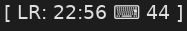

### A polybar plugin to measure average typing speed



`refresh_minutes` decares after how many minutes the average resets.

Credit to: https://github.com/polybar/polybar-scripts/tree/master/polybar-scripts/info-hackspeed

#### Setup

Change `KEYBOARD_ID` to your specific device. List all devices using `xinput list`

#### Module

```ini
[module/info-avg-hackspeed]
type = custom/script
exec = ~/polybar-config/info-hackspeed.py
tail = true
```